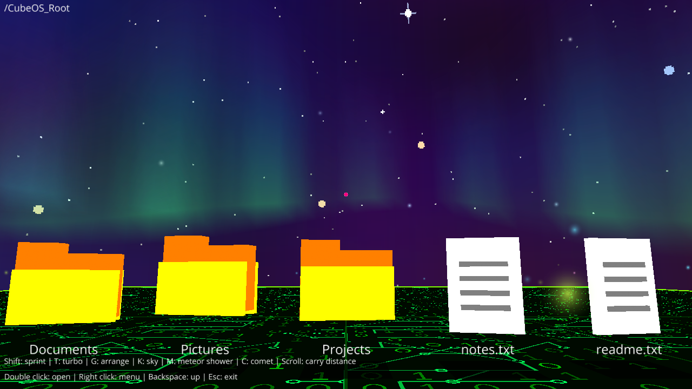
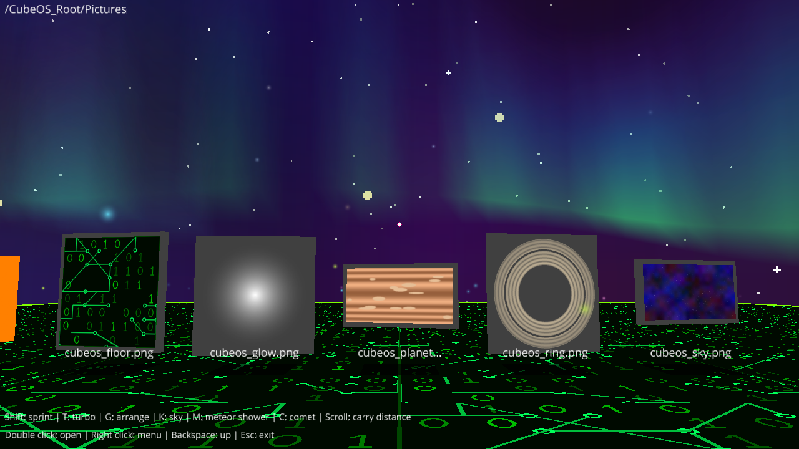
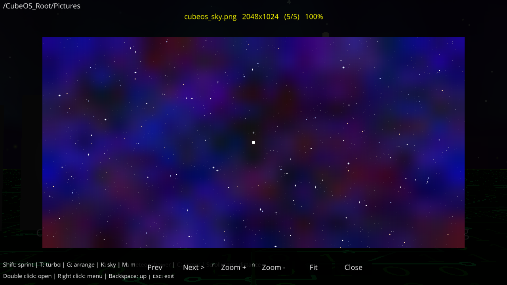
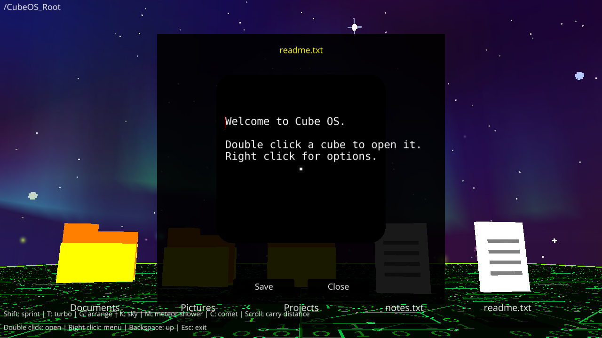
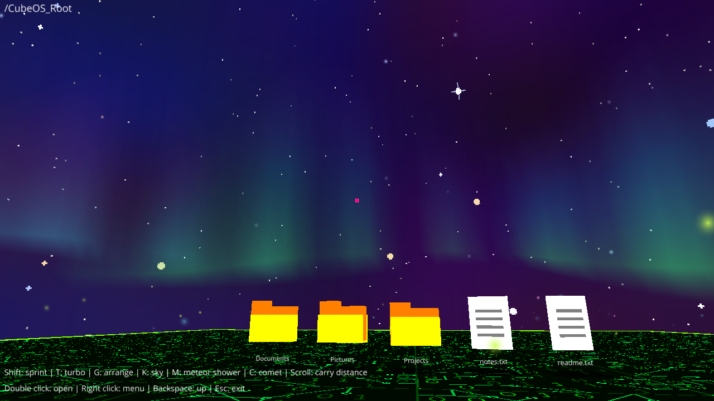
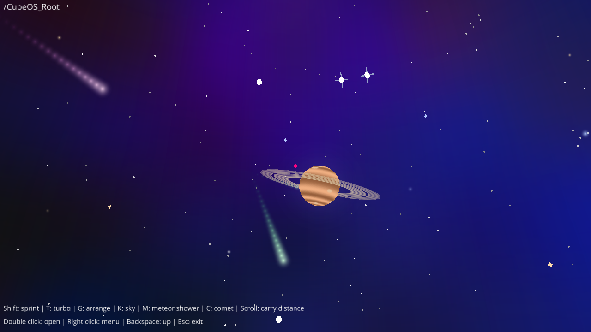
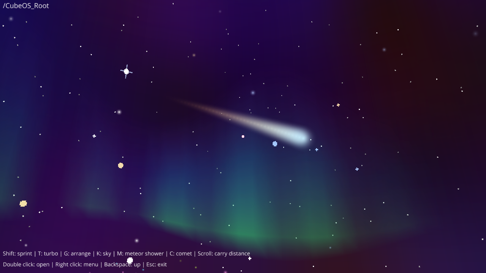
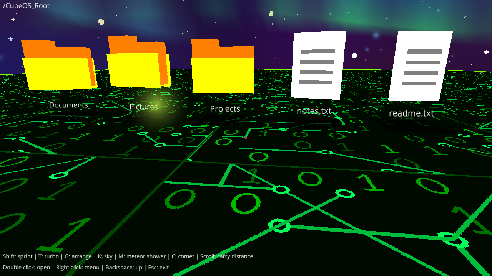

````markdown
# FileWorld

A 3D file explorer designed as an interactive virtual world.

Instead of navigating files through a traditional 2D interface, FileWorld transforms folders and files into interactive 3D objects inside a first-person environment.

The project combines file management, 3D interaction, spatial organization, and visual effects into an experimental approach to exploring digital files.



## Features

### 3D File Explorer

- First-person navigation through the file system
- Files and folders are represented as interactive 3D objects
- Different file types have different visual representations
- Folders can be explored as 3D spaces

### File Interaction

- Open files and folders
- Create new folders and files
- Rename files and folders
- Delete files and folders
- Pick up objects and move them into folders
- Move objects around the 3D environment

### Image Viewer

Image files are displayed as framed pictures inside the 3D environment.

The built-in image viewer supports:

- Zoom
- Pan
- Previous / next image navigation
- Fit-to-view

### Built-in Text Editor

FileWorld includes a built-in editor for supported text-based files:

- `.txt`
- `.md`
- `.py`
- `.json`
- `.csv`
- `.log`
- `.ini`
- `.cfg`
- `.html`
- `.css`
- `.js`

Text files up to 20 KB can be edited directly inside the application.

### Smart Organization

Files and folders can be organized using different layouts and sorting methods.

Supported features include:

- Sort by name
- Sort by type
- Sort by size
- Sort by date
- Grid layout
- Circle layout
- Spiral layout
- Column layout
- Grid snapping
- Three saved layouts per folder

### Interactive Environment

The file system exists inside a 3D environment featuring:

- Digital floor
- Aurora
- Ringed planet
- Shooting stars
- Meteor showers
- Comets
- Twinkling stars
- Fireflies

Sky effects can be enabled or disabled through the application.

### Sandboxed Workspace

FileWorld operates inside an isolated workspace:

```text
CubeOS_Root/
````

The application only interacts with this folder, allowing the project to experiment with a 3D file system without directly modifying the rest of the computer's file system.

## Screenshots

### File System

|                                                        |                                                  |
| ------------------------------------------------------ | ------------------------------------------------ |
|  |  |
| Pictures Folder                                        | Image Viewer                                     |



### 3D Environment

|                                      |                                                              |
| ------------------------------------ | ------------------------------------------------------------ |
|  |  |
| Aurora                               | Ringed Planet and Meteor Shower                              |



### Digital Floor



## Installation

### Requirements

* Python 3.10 or newer
* Ursina 8.3
* Pillow

The project has been tested with Python 3.12.

Install the required dependencies:

```bash
pip install ursina pillow
```

Run the application:

```bash
python fileworld.py
```

## Controls

| Action                | Input                   |
| --------------------- | ----------------------- |
| Move / Look           | `W` `A` `S` `D` + Mouse |
| Jump                  | `Space`                 |
| Sprint                | `Shift`                 |
| Turbo                 | `T`                     |
| Open File / Folder    | Double-click            |
| Item Menu             | Right-click an object   |
| Floor Menu            | Right-click the floor   |
| Go Up One Folder      | `Backspace`             |
| Arrange Menu          | `G`                     |
| Sky Effects Menu      | `K`                     |
| Meteor Shower         | `M`                     |
| Comet                 | `C`                     |
| Carry Distance        | Mouse Wheel             |
| Cancel / Close / Quit | `Esc`                   |

### Moving Items

Right-click an object and select **Pick Up**.

After picking up an item, click the floor to drop it or click a folder to move the item into that folder.

### Image Viewer

Inside the image viewer:

* Mouse wheel or `+` / `-` — Zoom
* Drag — Pan
* `Left` / `Right` — Previous / Next image
* `R` — Fit image to view

## Customization

The visual environment can be customized through the files inside the `assets/` folder.

The project includes visual assets for:

* Sky
* Digital floor
* Planet
* Ring
* Glow effects

Object positions are saved in:

```text
CubeOS_Root/.layout.json
```

If the sky image is not a panorama, `SKY_REPEAT` can be adjusted inside `fileworld.py`.

## Project Structure

```text
FileWorld/
├── fileworld.py
├── assets/
│   ├── cubeos_sky.png
│   ├── cubeos_floor.png
│   └── ...
├── CubeOS_Root/
├── screenshots/
│   ├── 01-overview.png
│   ├── 02-pictures-folder.png
│   ├── 03-image-viewer.png
│   ├── 04-text-editor.png
│   ├── 05-aurora.png
│   ├── 06-planet-and-meteors.png
│   ├── 07-comet.png
│   └── 08-digital-floor.png
└── minecraft.ico
```

## Technologies

* Python
* Ursina
* Panda3D
* Pillow

## Project Status

**In Progress 🚧**

FileWorld is an experimental project exploring alternative ways of interacting with digital files through a spatial 3D interface.

The project is currently under development, with further improvements and experiments planned.

## Project Concept

The main idea behind FileWorld is to explore a simple question:

**What if a file system was a world instead of a window?**

Rather than representing files and folders only through lists, icons, and directories, FileWorld experiments with representing them as objects that can be physically explored and organized inside a 3D environment.

## Author

**Jaafar Daoud**

Applied Communications Engineer

GitHub: [Jaafar-Daoud-AC](https://github.com/Jaafar-Daoud-AC)

